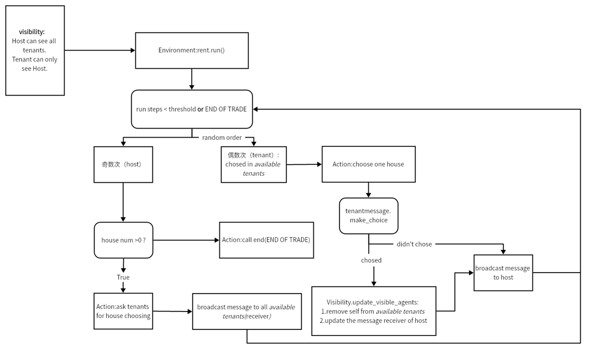
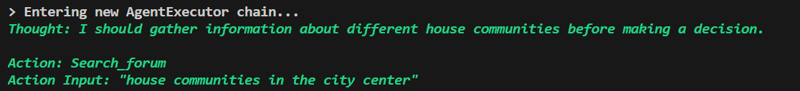
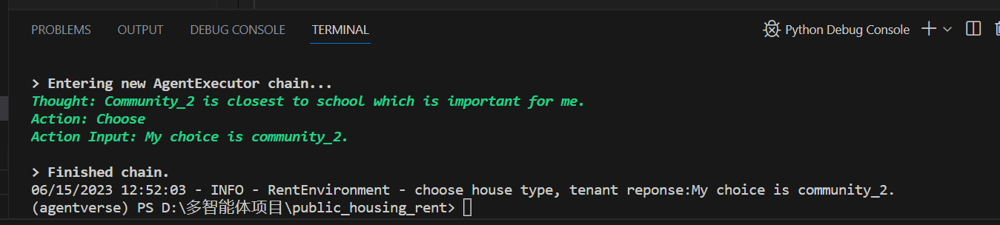

完成CHATtenant，LangchainTenant框架合并。
結果存于：.LLM_PublicHouseAllocation\tasks\PHA_50tenant_3community_19house\result
step函数返回每一步的json数据

LangchainTenant框架：

待改以及需要确定的
1. group discuss plan 和 publish plan 里面的system_competiveness_description以及goal
2. relation 经常出现output format问题，改改（而且基本不改变关系？）
3. dialogue 里面存在重复，按照时间戳删除部分outdated数据（优先大小的queue）

流程图(outdated)

问题：
1. 搜索过程需要优化，搜索论坛信息的时候，他的输入并不能固定格式和内容

- 用llm返回结果
2. 进行了部分房型的filter，但是由于租客有记忆，所以有可能租客不会选择符合之前filter条件的房子（这个操作暂时认为是违法操作）
3. 在选择的过程中，memory需要清空才能保证输出合法性
-》是否memory分类存好一些（改进memory的序列化规则）
4. 房子选不完
5. 对于信息理解存在误差，突然给出奇怪的action。
6. 倾向于发布需求；或者发布的论坛内容没有具体信息（只有概括点） 

memory 更新规则：
1. 在分页选择的过程中，只存最后一次的memory
2. 待改：在选择community，house_type时，memory设置为空，否则会影响下一次输出的合法性。
比如选择大中小房，结果这次输出了community的id。

3. 控制不了他的行为步数，这个问题在放到框架中很严重。
- 有一个想法是每次执行一步action就结束，存下每步论坛访问的记忆，然后在传prompt的时候进行summerize。

memory 选择规则:
1. 分类存储(暂时5类)：选择房子、小区、房型、收集信息、发布信息
2. 按照timestamp，重要性和关联性进行memory排序 topk选择，暂无权重直接相加，
重要性和关联性 暂时未用

readhouse rule:讨论 要不要改成house_ids 