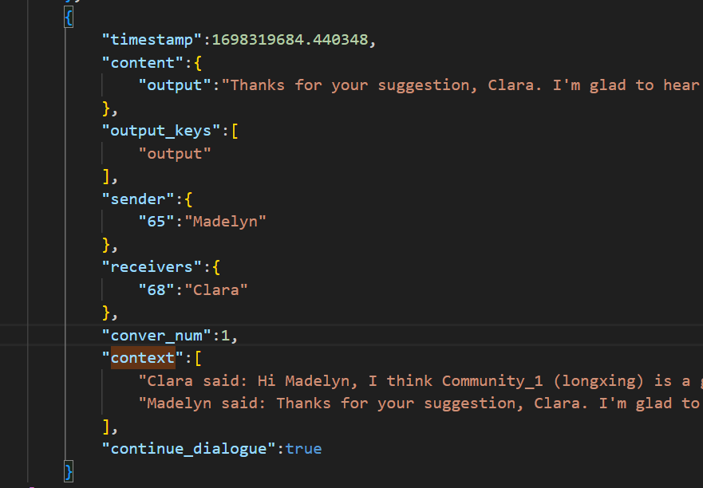

# Log Structure

ver1 政策：
注：house type表示house type

假设系统最多可以运行3轮(max_turn)，那么 一级index就是["group","1","2","3"]

- group:（若根据house type分队列）【注：在ver1政策内，直接按照 
    - tenant_id: 选队列时 （所有tenant都会有）
        - log_round: 选house type 时候的 发给前端的信息
        - log_round_prompts: 选house type 时候的 prompt和response
        - queue_name: 最终进入的队列名

- round_id : 系统运行的轮数 (environment.cnt_turn)
    - log_round: 发给前端的选择信息
        - tenant_id： tenant_id 号 tenant的选择信息
    - log_round_prompts: 选房过程的prompt和response
        - tenant_id： tenant_id 号 tenant的 选房过程 c,house type,h prompt，response

    - log_social_network:
        - social_network_mem: 【context相关】
            - tenant_id A:
                - mail (还没发的信息)
                - social_network(邻接表)
                    - tenant_id B:
                        - dialogues (A->B B->A) list存
                            - message [!!!实际需要在私聊界面展示的内容]

                        - chat_history （dialogues summary）
                        - relation
                        - comment

message的结构：

- timestamp: 生成私聊消息的时间戳
- context：私聊的历史记录
- content： 
    - output： 当前说的话（即为context的最后一句）
    - plan: 说话者的心理活动
- sender： 说话者 [tenant_id:tenant_name]
- receivers: 聆听者（可能有多个）[tenant_id:tenant_name]
- continue_dialogue: 当前说话者是否计划结束对话进程