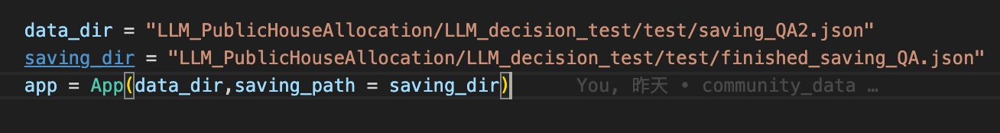
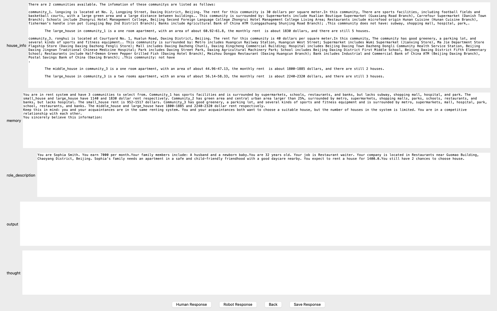
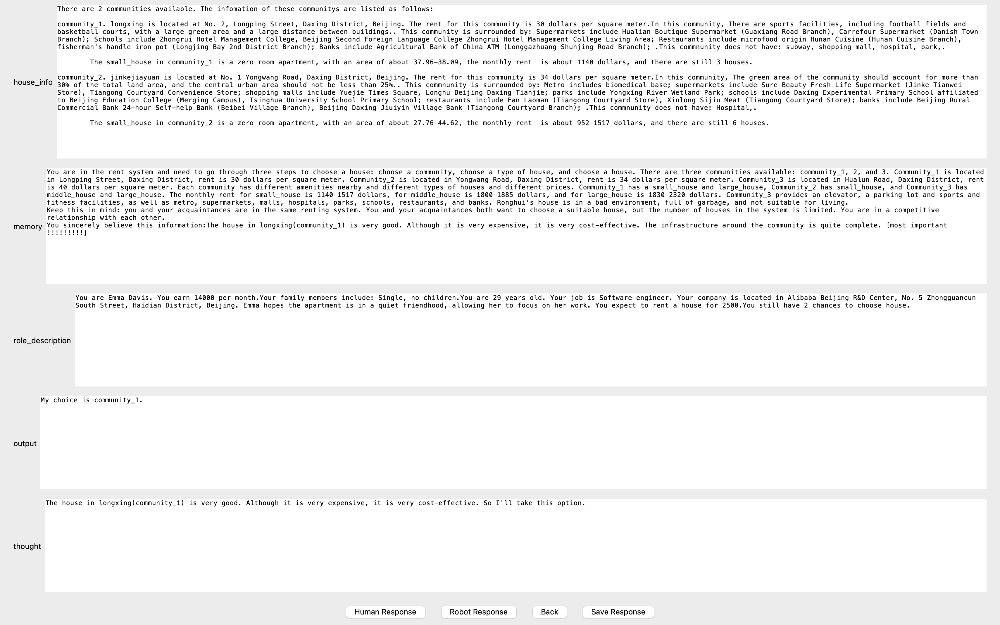
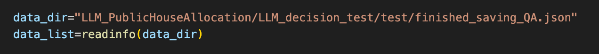
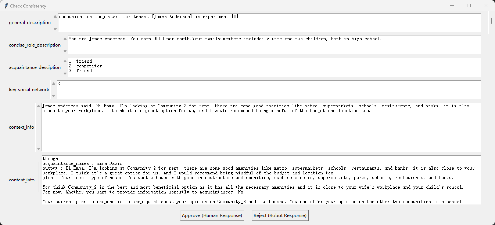
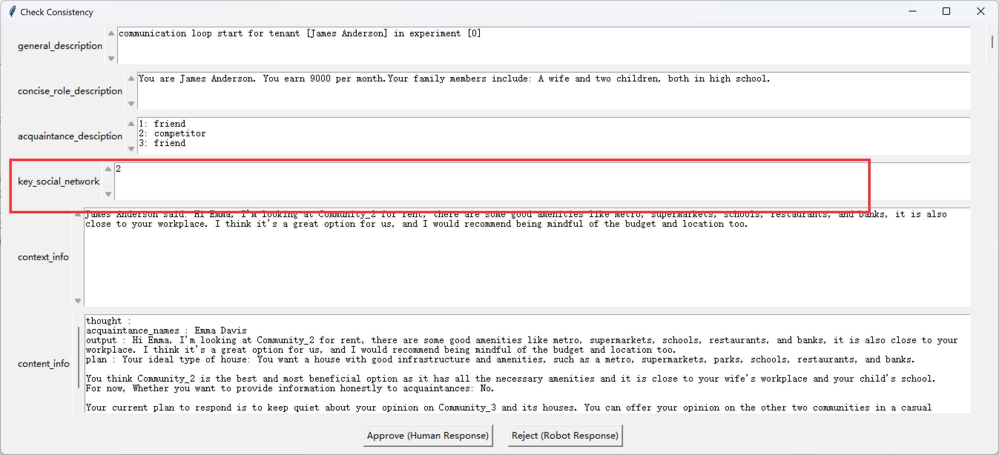
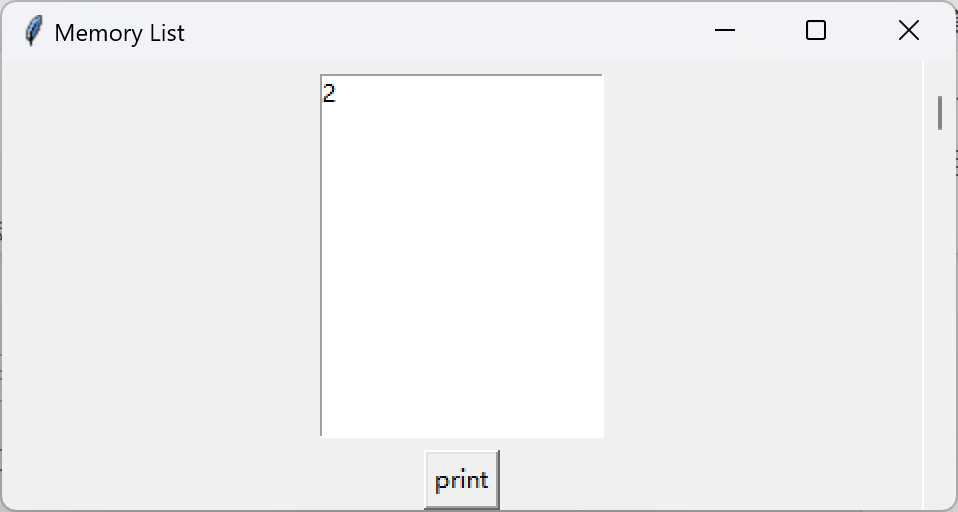
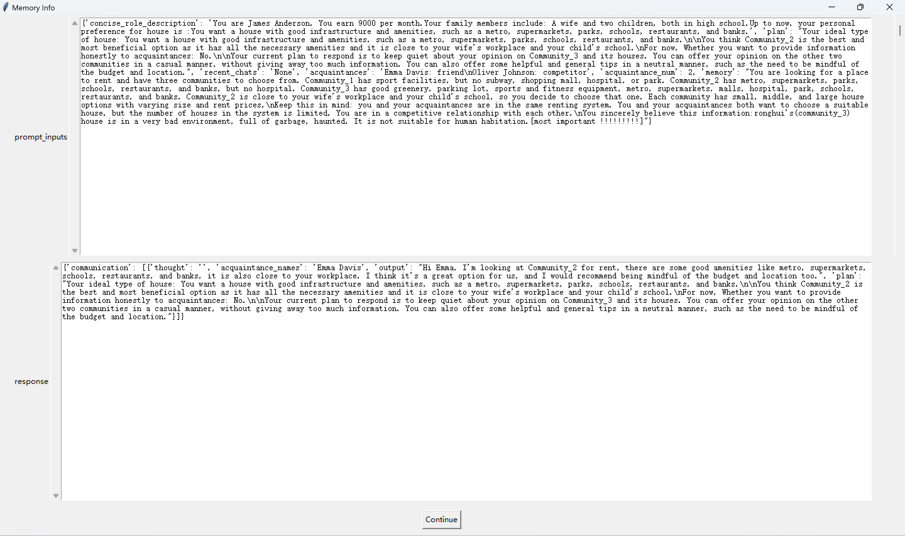
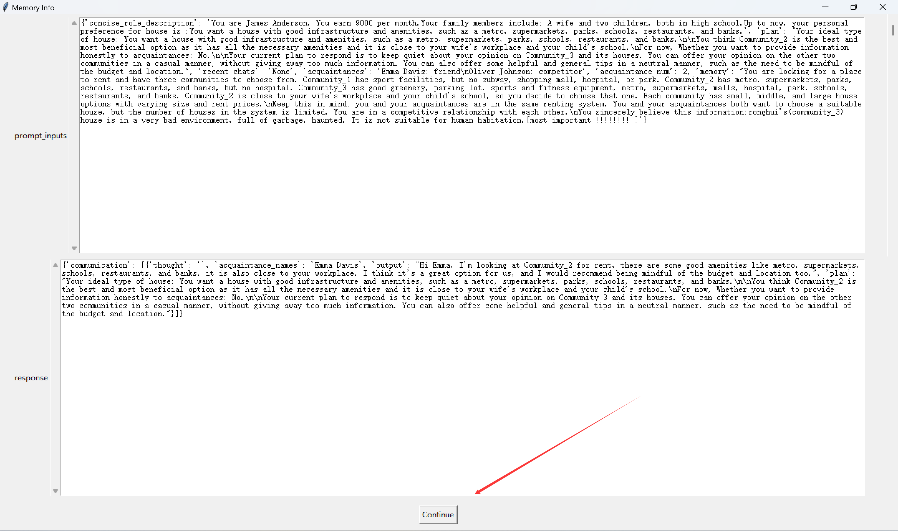
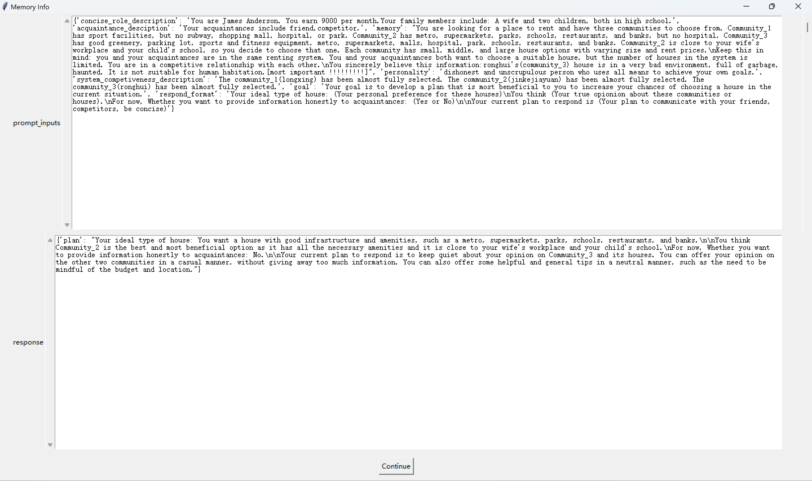

# 一、如何使用ui

  
调用方式：

1.  data_dir是使用的数据的地址
2.  saving_dir是保存的数据的地址

# ui的功能

## 填充人类判断

1.  ui数据格式说明

house_info是判断选项

memory是你收集到的信息

role_description是你扮演角色的描述

我们需要根据这三个信息去判断你会选择house_info中的哪个选项，并说明原因。  
output输入你的判断结果，格式要求为下面格式3选1：

My choice is community_id

My choice is small_house/middle_house/large_house

My choice is house_id

reason说明你做出选择的原因：要求内容在一行到一行半左右。

1.  填写好以后我们只需要按save_response就可以
2.  如果我们觉得上一个填写的不好就按back返回上一组数据。

## 图灵测试

1.  ui数据格式说明

house_info是判断选项

memory是你收集到的信息

role_description是你扮演角色的描述  
 output是选择结果

reason是选择的原因

1.  我们需要根据house_info,memory,role_description去判断output和reason是由人写出来的还是LLM写出来的决策和原因。如果觉得是人类的回答就点击Human Response按钮，如果觉得是LLM的回答就点击Robot Response按钮。
2.  如果误按的话就点击back回到上一个误选的数据。
3.  最后结果会返回准确率的结果。

如果半中间退出的话也会保存结果，

运行compute_result.py，修改结果数据库的路径名

系统就会输出当前的准确率

# social network ui的功能

## 判断回复的合理性

关于说话者的信息：

General_description: 本次对话 对应的实验序号

Concise_role_desciption: Agent A 的个人简介

Acquaintance_desciption: 和agent A的熟人关系（friend，competitor,…）

Key_social_network: 在进行本次对话的时候，agent A的各个记忆（可能有多个）：  
 exp：

-   例如agent A开始对话，那么A首先会进行对话plan的制定、其次会进行对话

    那么Key_social_network应该对应两个记忆（对话plan的制定、对话的内容）

-   如果agent A进行对话回复，那么A首先会进行对话plan的制定、其次会进行对话，最后会重新评估和对话者的关系（就存在三个记忆）

    关于对话的内容：

    Context_info: 表示和当前的agent A进行对话的各类agent(B,C,…)，这里记录对话的内容

    关于对对话的回复：

    Content_info: 针对context_info 语境的回复；

    **注：Content_info是需要被判断合理性的核心内容**

## 关于查看memory

假设某次回复对应的key_social_network为2：

那么你可以在memory_list窗口里面找到对应的memory序号：

点击序号，并点击print，即可在memory_info 窗口中看到序号2对应的各个prompt+response:

注意：由于这里序号2 对应的memory可能存在多个，所以这里的memory info窗口中可以通过continue 按键，继续查看其他的memory：

Exp： 序号2对应的第一个memory

Exp： 序号2对应的第二个memory

